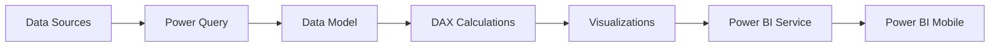

# Power BI Theory & Tutorial

This file provides comprehensive theory explanations for Power BI, mapped to the syllabus in `README.md`. Each section includes conceptual explanations, practical examples, and DAX/M code.

## Table of Contents
1. [Power BI Basics](#1-power-bi-basics)
2. [Data Sources \& Connectivity](#2-data-sources--connectivity)
3. [Power Query (Get \& Transform)](#3-power-query-get--transform)
4. [Data Modeling](#4-data-modeling)
5. [DAX (Data Analysis Expressions)](#5-dax-data-analysis-expressions)
6. [Visualizations](#6-visualizations)
7. [Reports \& Dashboards](#7-reports--dashboards)
8. [Power BI Service](#8-power-bi-service)
9. [Power BI Administration](#9-power-bi-administration)
10. [Advanced Topics](#10-advanced-topics)
11. [Power BI Integration](#11-power-bi-integration)

---

## 1. Power BI Basics

### 📖 What is Power BI?

**Power BI** is a business analytics service by Microsoft that enables you to visualize data and share insights across your organization. It transforms raw data into interactive dashboards and reports, making it easy for business users to make data-driven decisions.

**Key Components:**

| Component | Description | Use Case |
|-----------|-------------|----------|
| **Power BI Desktop** | Windows application for creating reports | Report development |
| **Power BI Service** | Cloud-based SaaS for publishing | Sharing and collaboration |
| **Power BI Mobile** | Mobile apps for iOS/Android | Viewing reports on-the-go |
| **Power BI Report Builder** | Paginated report builder | Printable reports |
| **Power BI Embedded** | Embedding analytics in apps | Custom applications |

**Why is this important for Data Engineering?**

- Self-service BI enables business users to create their own reports
- Reduces dependency on IT for basic reporting needs
- Integration with Azure data services
- Supports modern data warehouse patterns
- Provides API access for automation

### Power BI Architecture



### Power BI Workflow

```python
# Typical Power BI Development Workflow

# 1. Get Data
# Connect to data sources using Get Data or Power Query

# 2. Transform
# Clean and transform data using Power Query Editor

# 3. Model
# Create data model with relationships

# 4. Calculate
# Write DAX measures for calculations

# 5. Visualize
# Build visualizations and reports

# 6. Publish
# Publish to Power BI Service

# 7. Share
# Share with stakeholders via workspaces/apps
```

### Key Concepts

- **Workspace**: Container for reports, dashboards, and datasets
- **Dataset**: Collection of data from one or more sources
- **Report**: Single-page or multi-page visualization
- **Dashboard**: Single-page collection of tiles
- **Tile**: Single visualization on a dashboard

---

## 2. Data Sources & Connectivity

### 📖 What are Data Sources & Connectivity?

**Data Sources & Connectivity** refers to how Power BI connects to various data sources to import or query data. Understanding the different connection modes is crucial for performance optimization.

**Key Concepts:**

| Connection Mode | Description | Refresh | Performance |
|----------------|-------------|---------|-------------|
| **Import** | Data copied to PBIX | Scheduled/In-app | Fast |
| **DirectQuery** | Query source in real-time | Real-time | Slow |
| **Live Connection** | Connect to Analysis Services | Real-time | Depends |
| **Composite** | Mix of Import and DirectQuery | Hybrid | Variable |

**Why is this important for Data Engineering?**

- Choosing the right connection mode affects performance
- DirectQuery required for real-time data
- Import mode enables full DAX functionality
- Composite models enable hybrid scenarios

### Import Mode

```dax
// Import mode loads all data into the model
// Benefits:
// - Full DAX functionality
// - Fast visualization rendering
// - No source database load during refresh

// Limitations:
// - Data size limits (1GB for Pro, 10GB for Premium)
// - Data freshness depends on refresh schedule
```

### DirectQuery Mode

```dax
// DirectQuery sends queries to the source database
// Benefits:
// - Always current data
// - No data size limits
// - Supports large datasets

// Limitations:
// - Limited DAX functionality
// - Slower visualization rendering
// - Source database must handle query load

// Use when:
// - Real-time data required
// - Data too large for import
// - Security at row-level required
```

### Live Connection

```dax
// Live Connection connects to:
// - SQL Server Analysis Services (SSAS)
// - Azure Analysis Services
// - Power BI Datasets (in same workspace)

// Benefits:
// - Single source of truth
// - Enterprise BI integration
// - No data duplication

// Limitations:
// - Requires SSAS/AAS infrastructure
// - Limited transformation capabilities
```

### Supported Data Sources

```python
# Categories of Data Sources

# Files
# - Excel (.xlsx, .xlsb)
# - CSV
# - XML
# - JSON
# - Power BI template (.pbit)

# Databases
# - SQL Server
# - Azure SQL Database
# - Azure Synapse Analytics
# - PostgreSQL
# - MySQL
# - Oracle
# - IBM DB2

# Cloud Services
# - Azure Blob Storage
# - Azure Data Lake
# - SharePoint Online
# - OneDrive
# - Snowflake
# - Google Analytics

# Other
# - Web
# - REST APIs
# - OData
# - Hadoop
# - Spark
```

### Connecting to Data Sources

```dax
// Power Query M Language Examples

// Connect to SQL Server
let
    Source = Sql.Database("servername", "databasename"),
    dbo_Table = Source{[Schema="dbo",Item="TableName"]}[Data]
in
    dbo_Table

// Connect to CSV
let
    Source = Csv.Document(File.Contents("C:\data\file.csv"),
        [Delimiter=",", Encoding=65001]),
    PromotedHeaders = Table.PromoteHeaders(Source,
        [PromoteAllScalars=true])
in
    PromotedHeaders

// Connect to Web
let
    Source = Web.Contents("https://api.example.com/data"),
    #"JSON" = Json.Document(Source)
in
    #"JSON"
```

---

## 3. Power Query (Get & Transform)

### 📖 What is Power Query?

**Power Query** is a data transformation engine in Power BI that allows you to connect to data sources, clean, transform, and reshape data before loading it into the data model. It provides a graphical interface for ETL (Extract, Transform, Load) operations.

**Key Concepts:**

- **Power Query Editor**: Visual interface for transformations
- **M Language**: The formula language behind Power Query
- **Steps**: Each transformation is recorded as a step
- **Applied Steps**: Sequential list of transformations

**Why is this important for Data Engineering?**

- Essential for data cleaning and preparation
- Reduces data quality issues in reports
- Enables self-service ETL
- Reusable queries across reports

### Basic Transformations

```m
// Remove Columns
Table.RemoveColumns(Source, {"ColumnName1", "ColumnName2"})

// Filter Rows
Table.SelectRows(Source, each [ColumnName] > 100)

// Remove Duplicates
Table.Distinct(Source)

// Rename Column
Table.RenameColumns(Source, {{"OldName", "NewName"}})

// Change Data Type
Table.TransformColumnTypes(Source, {{"ColumnName", type number}})
```

### Filtering Data

```m
// Filter rows - equals
Table.SelectRows(Source, each [Status] = "Active")

// Filter rows - not equals
Table.SelectRows(Source, each [Status] <> "Inactive")

// Filter rows - greater than
Table.SelectRows(Source, each [Amount] > 1000)

// Filter rows - contains
Table.SelectRows(Source, each Text.Contains([Name], "Corporation"))

// Filter rows - in list
Table.SelectRows(Source, each List.Contains({"Active", "Pending"}, [Status]))

// Remove nulls
Table.SelectRows(Source, each [ColumnName] <> null)
```

### Pivot and Unpivot

```m
// Pivot - transform rows to columns
Table.Pivot(Source,
    List.Distinct(Source[Attribute]),
    "Attribute",
    "Value",
    List.Sum)

// Unpivot - transform columns to rows
Table.UnpivotOtherColumns(Source,
    {"ID", "Name"},
    "Attribute",
    "Value")
```

### Merging Queries

```m
// Merge queries (like JOIN)
Table.NestedJoin(Source1,
    {"KeyColumn"},
    Source2,
    {"KeyColumn"},
    "NewColumnName",
    JoinKind.LeftOuter)

// Expand merged column
Table.ExpandTableColumn(Source, "NewColumnName",
    {"Column1", "Column2"},
    {"Column1", "Column2"})

// Append queries (union)
Table.Combine({Source1, Source2})
```

### Creating Custom Columns

```m
// Simple calculation
Table.AddColumn(Source, "Total",
    each [Quantity] * [UnitPrice])

// Conditional logic
Table.AddColumn(Source, "Category",
    each if [Amount] > 1000 then "High"
    else if [Amount] > 500 then "Medium"
    else "Low")

// Date functions
Table.AddColumn(Source, "Year",
    each Date.Year([OrderDate]))

Table.AddColumn(Source, "MonthName",
    each Date.MonthName([OrderDate]))

// Text functions
Table.AddColumn(Source, "FullName",
    each [FirstName] & " " & [LastName])

Table.AddColumn(Source, "UpperName",
    each Text.Upper([Name]))
```

### Advanced Transformations

```m
// Group by and aggregate
Table.Group(Source,
    {"Category"},
    {{"TotalSales", each List.Sum([Sales]), type number},
     {"Count", each Table.RowCount(_), Int64.Type}})

// Running total
Table.AddColumn(Source, "RunningTotal",
    let
        _index = [Index]
    in
        List.Sum(List.Range(Source[Sales], 0, _index + 1)),
    type number)

// Fill down (forward fill)
Table.FillDown(Source, {{"ColumnName", null}})

// Replace values
Table.ReplaceValue(Source,"OldValue","NewValue",
    Replacer.ReplaceText,{"ColumnName"})

// Split column
Table.SplitColumn(Source, "FullName",
    Splitter.SplitByDelimiters({" "}),
    {"FirstName", "LastName"})
```

### M Language Basics

```m
// Variables
let
    Source = Excel.CurrentWorkbook(){[Name="Table1"]}[Content],
    Filtered = Table.SelectRows(Source, each [Value] > 10),
    Result = Table.Group(Filtered, {"Category"},
        {{"Total", each List.Sum([Value]), type number}})
in
    Result

// Custom Function
(InputTable as table) =>
let
    Source = InputTable,
    AddedColumn = Table.AddColumn(Source, "NewCol",
        each [Col1] * 2, type number)
in
    AddedColumn

// Error Handling
try
    Source{0}[ColumnName]
otherwise
    "DefaultValue"
```

---

## 4. Data Modeling

### 📖 What is Data Modeling?

**Data Modeling** is the process of organizing and structuring data in Power BI to enable efficient analysis. A well-designed data model is the foundation for performant reports and accurate calculations.

**Key Concepts:**

- **Star Schema**: Dimensional modeling with fact and dimension tables
- **Relationships**: Connections between tables
- **Cardinality**: Type of relationship (one-to-one, one-to-many, many-to-many)
- **Cross-filter Direction**: How filters propagate

**Why is this important for Data Engineering?**

- Optimizes query performance
- Ensures accurate calculations
- Enables self-service reporting
- Follows industry best practices

### Star Schema

```python
# Star Schema Components

# Fact Table (Center)
# - Contains quantitative data (measures)
# - Foreign keys to dimension tables
# - Example: Sales, Orders, Transactions

# Dimension Tables (Points of Star)
# - Descriptive attributes
# - Connected to fact table
# - Example: Customers, Products, Dates, Locations

# Benefits:
# - Simple to understand
# - Fast query performance
# - Easy to maintain
# - Supports drill-down
```

### Fact and Dimension Tables

```dax
// Fact Table Example: FactSales
// Columns: SalesKey, DateKey, ProductKey, CustomerKey, Quantity, SalesAmount, Cost

// Dimension Table Example: DimCustomer
// Columns: CustomerKey, CustomerName, Email, City, State, Country, Segment

// Dimension Table Example: DimProduct
// Columns: ProductKey, ProductName, Category, SubCategory, Brand, Price

// Dimension Table Example: DimDate
// Columns: DateKey, Date, Year, Quarter, Month, MonthName, Day, Weekday
```

### Relationships

```dax
// Relationship Properties

// Cardinality Types:
// - One to One (1:1): Rare, usually merged
// - One to Many (1:*): Most common
// - Many to Many (*:*): Use with caution

// Cross Filter Direction:
// - Single: Filters flow one direction
// - Both: Filters flow both directions (use carefully)

// Relationship Properties:
// - Assume referential integrity: Use INNER JOIN instead of LEFT JOIN
// - Make relationship active: Can be deactivated for complex scenarios

// DAX relationship functions:
// - RELATED(): Follow relationship from many to one
// - RELATEDTABLE(): Follow relationship from one to many
// - USERELATIONSHIP(): Use inactive relationship
```

### Creating Relationships in Power BI

```dax
// Relationship Best Practices

// 1. Use surrogate keys (integer IDs)
DimProduct[ProductKey] --> FactSales[ProductKey]

// 2. Avoid relationships on text columns
// Instead of: DimProduct[ProductName] --> FactSales[ProductName]
// Use: DimProduct[ProductKey] --> FactSales[ProductKey]

// 3. One-to-many direction
// Many side (fact): Multiple rows per key
// One side (dimension): One row per key

// 4. Bidirectional filtering sparingly
// Only when necessary, impacts performance

// 5. Role-playing dimensions
// Multiple relationships to same dimension
// Use USERELATIONSHIP() in DAX
```

### Calculated Columns vs Measures

```dax
// CALCULATED COLUMNS
// - Computed at row level during refresh
// - Stored in the model
// - Use more memory
// - Can be used in slicers

// Example: Full Name
Full Name = DimCustomer[FirstName] & " " & DimCustomer[LastName]

// Example: Year
Year = YEAR(DimDate[Date])

// MEASURES
// - Computed at query time
// - Not stored in model (aggregates only)
// - Memory efficient
// - Dynamic results

// Example: Total Sales
Total Sales = SUM(FactSales[SalesAmount])

// Example: Average Order Value
Average Order Value = AVERAGE(FactSales[SalesAmount])

// When to use what:
// - Use calculated columns for:
//   - Categorization/slicing
//   - Complex text combinations
//   - Row-level security
// - Use measures for:
//   - Aggregations
//   - KPIs
//   - Dynamic calculations
```

### Hierarchies

```dax
// Creating Hierarchies in Power BI

// 1. In Field pane, right-click field
// 2. Create hierarchy
// 3. Add fields in order (lowest to highest)

// Example Date Hierarchy:
// Date --> Year --> Quarter --> Month --> Day

// Example Geography Hierarchy:
// Country --> State --> City --> Store

// Using hierarchies in visuals:
// - Automatic drill-down
// - Consistent grouping
// - Parent-child relationships
```

### Row-Level Security (RLS)

```dax
// Row-Level Security in Power BI

// 1. Create roles in Power BI Desktop
// 2. Define DAX filter expressions
// 3. Assign users in Power BI Service

// Example: Regional Manager
// Role: RegionalManager
// DAX: 'DimRegion'[Region] = USERNAME()

// Example: Sales Team
// Role: SalesTeam
// DAX: 'DimSalesRep'[Email] = USERPRINCIPALNAME()

// Dynamic RLS:
FILTER(ALL('DimCustomer'),
    'DimCustomer'[Region] = LOOKUPVALUE('DimUserRegion'[Region],
        'DimUserRegion'[UserEmail],
        USERPRINCIPALNAME()))

// Test RLS in Power BI Desktop:
// View as Role option in Modeling tab
```

---

## 5. DAX (Data Analysis Expressions)

### 📖 What is DAX?

**DAX (Data Analysis Expressions)** is a formula language in Power BI used for creating calculated columns, measures, and custom tables. It extends Excel's formula capabilities to work with relational data.

**Key Concepts:**

- **Filter Context**: The set of filters applied to a calculation
- **Row Context**: Current row being evaluated
- **Context Transition**: Converting row context to filter context
- **Iterator Functions**: Functions that iterate over tables

**Why is this important for Data Engineering?**

- Enables complex business calculations
- Creates dynamic, interactive reports
- Calculates KPIs and metrics
- Implements business logic

### Basic DAX Syntax

```dax
// Basic Syntax Rules

// Measure Syntax
Measure Name := DAX_Expression

// Calculated Column Syntax
Column Name := DAX_Expression

// Calculated Table Syntax
Table Name := DAX_Expression

// Comments
// Single line comment
/* Multi-line
   comment */

// Formatting
Total Sales :=
SUM ( FactSales[SalesAmount] )

// Case insensitive
SUM = sum = Sum
```

### Basic Aggregation Functions

```dax
// SUM
Total Sales := SUM(FactSales[SalesAmount])

// AVERAGE
Average Sales := AVERAGE(FactSales[SalesAmount])

// COUNT
Order Count := COUNT(FactSales[OrderKey])

// COUNTROWS
Total Rows := COUNTROWS(FactSales)

// DISTINCTCOUNT
Unique Customers := DISTINCTCOUNT(FactSales[CustomerKey])

// MIN / MAX
Min Order := MIN(FactSales[OrderAmount])
Max Order := MAX(FactSales[OrderAmount])

// SUMX / AVERAGEX (Iterators)
Total Profit :=
SUMX(FactSales,
    FactSales[SalesAmount] - FactSales[Cost])

Average Margin :=
AVERAGEX(FactSales,
    FactSales[SalesAmount] - FactSales[Cost])
```

### Filter Context

```dax
// Filter Context Explained
// Filter context is the set of filters applied to a calculation
// Automatically created by:
// - Visual filters (slicers, cross-filtering)
// - Row/column headers
// - CALCULATE function

// Example: Total Sales in a visual
// When filtered by Year = 2024:
// Filter context = {Year = 2024}
// Total Sales = SUM(FactSales[SalesAmount]) filtered by Year = 2024

// ALL Function - Remove Filters
Total Sales All Years :=
CALCULATE(
    SUM(FactSales[SalesAmount]),
    ALL(DimDate)  // Remove all filters on Date table
)

// ALLEXCEPT - Remove filters except specified
Sales All Years Except Month :=
CALCULATE(
    SUM(FactSales[SalesAmount]),
    ALLEXCEPT(DimDate, DimDate[Year])
)

// ALLSELECTED - Remove visual filters but keep slicers
Sales All Selected :=
CALCULATE(
    SUM(FactSales[SalesAmount]),
    ALLSELECTED()
)
```

### CALCULATE Function

```dax
// CALCULATE - Most Important DAX Function
// Syntax: CALCULATE(expression, filter1, filter2, ...)

// Basic usage
Sales 2024 :=
CALCULATE(
    SUM(FactSales[SalesAmount]),
    DimDate[Year] = 2024
)

// Multiple filters (AND)
Sales 2024 Electronics :=
CALCULATE(
    SUM(FactSales[SalesAmount]),
    DimDate[Year] = 2024,
    DimProduct[Category] = "Electronics"
)

// OR conditions
Sales High Value :=
CALCULATE(
    SUM(FactSales[SalesAmount]),
    FILTER(ALL(FactSales),
        FactSales[SalesAmount] > 1000
    )
)

// Using Variables in CALCULATE
Regional Sales :=
VAR SelectedRegion = SELECTEDVALUE(DimRegion[Region])
RETURN
CALCULATE(
    SUM(FactSales[SalesAmount]),
    DimRegion[Region] = SelectedRegion
)
```

### Time Intelligence Functions

```dax
// Time Intelligence Functions require proper Date table

// Total YTD
Sales YTD :=
TOTALYTD(
    SUM(FactSales[SalesAmount]),
    DimDate[Date]
)

// Total QTD
Sales QTD :=
TOTALQTD(
    SUM(FactSales[SalesAmount]),
    DimDate[Date]
)

// Total MTD
Sales MTD :=
TOTALMTD(
    SUM(FactSales[SalesAmount]),
    DimDate[Date]
)

// Same Period Last Year
Sales PY :=
CALCULATE(
    SUM(FactSales[SalesAmount]),
    SAMEPERIODLASTYEAR(DimDate[Date])
)

// Year Over Year Growth
YoY Growth :=
VAR CurrentSales = SUM(FactSales[SalesAmount])
VAR PreviousSales = CALCULATE(
    SUM(FactSales[SalesAmount]),
    SAMEPERIODLASTYEAR(DimDate[Date])
)
RETURN
DIVIDE(CurrentSales - PreviousSales, PreviousSales)

// Moving Average (Last 3 Months)
Moving Avg 3M :=
AVERAGEX(
    DATESINPERIOD(DimDate[Date], LASTDATE(DimDate[Date]), -3, MONTH),
    CALCULATE(SUM(FactSales[SalesAmount]))
)
```

### Iterator Functions

```dax
// Iterator Functions iterate over each row in a table

// SUMX
Total Cost :=
SUMX(
    FactSales,
    FactSales[Quantity] * FactSales[UnitCost]
)

// AVERAGEX
Avg Order Value :=
AVERAGEX(
    FactSales,
    FactSales[SalesAmount]
)

// COUNTX
Non-Blank Orders :=
COUNTX(
    FactSales,
    FactSales[OrderKey]
)

// MAXX / MINX
Max Order Per Customer :=
MAXX(
    Customer,
    CALCULATE(SUM(FactSales[SalesAmount]))
)

// FILTER inside iterators
High Value Orders :=
SUMX(
    FILTER(FactSales, FactSales[SalesAmount] > 1000),
    FactSales[SalesAmount]
)
```

### Context Transition

```dax
// Context Transition: Row context to Filter context

// Row context exists in:
// - Calculated columns
// - Iterator functions

// CALCULATE creates filter context

// Example: Calculated Column with context transition
Total Sales per Customer :=
CALCULATE(
    SUM(FactSales[SalesAmount])
)

// This calculated column calculates Total Sales for each customer
// Context transition happens when iterating through customer rows

// Example: Measure with iterator
Customer Sales Rank :=
SUMX(
    DimCustomer,
    VAR CustomerSales = CALCULATE(SUM(FactSales[SalesAmount]))
    RETURN
    CustomerSales
)
```

### Variables in DAX

```dax
// Variables improve performance and readability

// Basic variable
Total Profit :=
VAR TotalSales = SUM(FactSales[SalesAmount])
VAR TotalCost = SUM(FactSales[Cost])
RETURN
    TotalSales - TotalCost

// Multiple variables
Profit Margin :=
VAR Sales = SUM(FactSales[SalesAmount])
VAR Cost = SUM(FactSales[Cost])
VAR Profit = Sales - Cost
RETURN
    DIVIDE(Profit, Sales)

// Variable with conditional logic
Performance Indicator :=
VAR Target = 100000
VAR Actual = SUM(FactSales[SalesAmount])
VAR Achievement = DIVIDE(Actual, Target)
RETURN
    IF(Achievement >= 1, "Target Met",
        IF(Achievement >= 0.8, "On Track", "Below Target"))
```

### Advanced DAX Patterns

```dax
// Running Total
Running Total :=
CALCULATE(
    SUM(FactSales[SalesAmount]),
    FILTER(
        ALL(DimDate),
        DimDate[Date] <= MAX(DimDate[Date])
    )
)

// Rank
Customer Rank :=
RANKX(
    ALL(DimCustomer),
    CALCULATE(SUM(FactSales[SalesAmount])),
    ,
    DESC,
    DENSE
)

// Top N Customers
Top 10 Customers :=
TOPN(
    10,
    ADDCOLUMNS(
        ALL(DimCustomer),
        "Sales", CALCULATE(SUM(FactSales[SalesAmount]))
    ),
    [Sales],
    DESC
)

// Cumulative Distinct Count
Cumulative Customers :=
CALCULATE(
    DISTINCTCOUNT(FactSales[CustomerKey]),
    FILTER(
        ALL(DimDate),
        DimDate[Date] <= MAX(DimDate[Date])
    )
)

// ABC Analysis
Product Category :=
VAR SalesSum = SUM(FactSales[SalesAmount])
VAR TotalSales = CALCULATE(SUM(FactSales[SalesAmount]), ALL(DimProduct))
VAR Percent = DIVIDE(SalesSum, TotalSales)
RETURN
    IF(Percent > 0.7, "C",
        IF(Percent > 0.4, "B", "A"))
```

---

## 6. Visualizations

### 📖 What are Visualizations?

**Visualizations** in Power BI are graphical representations of data that make it easier to understand patterns, trends, and insights. Power BI offers a wide variety of built-in and custom visuals.

**Key Concepts:**

- **Visual Types**: Different charts for different data patterns
- **Fields**: Data values to display
- **Filters**: Ways to slice data
- **Interactions**: How visuals affect each other

**Why is this important for Data Engineering?**

- Data storytelling through visualizations
- Self-service reporting
- Interactive dashboards
- Data-driven decision making

### Basic Visual Types

```dax
// Visual Type Selection Guide

// Comparison over time:
// - Line chart
// - Area chart
// - Column chart

// Part-to-whole:
// - Pie chart (use sparingly)
// - Donut chart
// - Treemap
// - Stacked bar

// Distribution:
// - Histogram
// - Box plot
// - Scatter plot

// Relationship:
// - Scatter plot
// - Bubble chart

// Geographic:
// - Map
// - Filled map

// Single value:
// - Card
// - KPI
// - Gauge
```

### Field Wells

```dax
// Visual Field Configuration

// Axis:
// - Category/column to group by
// - Used in: Bar, Column, Line, Pie

// Legend:
// - Additional grouping
// - Creates series
// - Used in: Line, Pie, Treemap

// Values:
// - Numeric data to aggregate
// - Used in: All chart types

// Tooltips:
// - Additional info on hover

// Filters:
// - Visual level
// - Page level
// - Report level
```

### Slicers

```dax
// Slicer Types

// 1. Between slicer (numeric ranges)
//    Between: Select range
//    And: Lower and upper bound

// 2. List slicer (categorical)
//    Checkbox: Multi-select
//    Dropdown: Single select

// 3. Relative slicer (dates)
//    Last: X periods
//    This: Current period
//    Next: Future periods

// Slicer Options:
// - Show "All" option
// - Single select
// - Multi-select with Ctrl
// - Sort by

// Syncing slicers across pages
// Use Sync Slicers pane
```

### Interactions and Cross-Filtering

```dax
// Visual Interactions

// Three interaction types:
// 1. Filter (default): Highlight selected, dim others
// 2. Highlight: Keep all, highlight matches
// 3. None: No interaction

// Edit Interactions:
// 1. Select visual
// 2. Go to Format > Edit Interactions
// 3. Click icons on other visuals

// Cross-filter direction:
// - Single direction: Filtering affects downstream
// - Both directions: Bidirectional filtering
```

### Maps and Geographics

```dax
// Map Visualizations

// 1. Map (Bing maps)
// Required: Latitude, Longitude OR Location

// 2. Filled Map (Choropleth)
// Required: Location (Country/State/City)
// Shows density by color

// 3. ArcGIS Maps
// Advanced geospatial analysis

// Geographic hierarchy:
// Country > State > City > Postal Code

// Best practices:
// - Use standard geographic roles
// - Enable Show items with no data
// - Use appropriate granularity
```

### KPI and Gauge Visuals

```dax
// KPI Visual

// Fields required:
// - Indicator (value to track)
// - Target goal
// - Trend axis (time)

// Gauge Visual

// Fields:
// - Value
// - Target (optional)
// - Minimum value
// - Maximum value

// Use cases:
// - Dashboard metrics
// - Target tracking
// - Performance indicators
```

### Custom Visuals

```dax
// Custom Visuals from Marketplace

// Popular custom visuals:
// - Word Cloud
// - Timeline
// - Sankey diagram
// - Funnel chart
// - Sunburst
// - Bullet chart
// - Infographic designer

// Importing custom visuals:
// 1. Click ellipsis in Visualizations pane
// 2. Import from marketplace
// 3. Import from file (.pbiviz)

// R Visuals:
// - Requires R installation
// - Custom R code
// - Advanced analytics

// Python Visuals:
// - Requires Python installation
// - Python scripts
// - Machine learning integration
```

---

## 7. Reports & Dashboards

### 📖 What are Reports & Dashboards?

**Reports** are multi-page collections of visualizations that explore data in detail. **Dashboards** are single-page collections of tiles that provide at-a-glance metrics.

**Key Concepts:**

- **Report Pages**: Individual views with visualizations
- **Tiles**: Single visualizations on dashboards
- **Bookmarks**: Save visual states
- **Drill-through**: Navigate between report pages

**Why is this important for Data Engineering?**

- Deliver business insights
- Self-service reporting
- Interactive data exploration
- Executive summaries

### Report Design Best Practices

```dax
// Report Layout

// 1. Standard report sizes:
// - 16:9 (1280x720) - Default
// - 16:10
// - 4:3
// - Custom

// 2. Visual placement:
// - Logical flow (left to right, top to bottom)
// - Related visuals grouped together
// - Use whitespace effectively

// 3. Color usage:
// - Consistent palette
// - Highlight important data
// - Consider colorblind users

// 4. Typography:
// - Clear headers
// - Readable font sizes
// - Consistent formatting
```

### Creating Drill-Through Reports

```dax
// Drill-Through Setup

// 1. Create detail page
// 2. Add visual(s) to display
// 3. Set drill-through fields

// Drill-through field:
// - Drag field to Drill-through well
// - Page becomes drill-through target

// 4. Navigation:
// - Right-click visual > Drill through
// - Back button to return

// Drill-through best practices:
// - Name page clearly
// - Add return button
// - Use visual headers
```

### Bookmarks

```dax
// Bookmarks

// Purpose:
// - Save visual state
// - Create presentation mode
// - Button navigation

// Creating bookmarks:
// 1. View > Bookmarks pane
// 2. Position visuals as desired
// 3. Add bookmark with name
// 4. Repeat for each state

// Bookmark options:
// - Data: Include current filters
// - Current page: Page context
// - Display: Visual properties

// Using with buttons:
// - Action type: Bookmark
// - Select bookmark
```

### Buttons and Navigation

```dax
// Buttons in Power BI

// Button types:
// - Back
// - Bookmark
// - Drill through
// - Page navigation
// - Q&A
// - Web URL

// Button actions:
// 1. Select button
// 2. Format > Action
// 3. Enable action
// 4. Choose action type

// Page navigation:
// - Type: Page navigation
// - Destination: Select page
```

### Dashboards

```dax
// Dashboard Tiles

// Creating dashboard:
// 1. Publish report to Service
// 2. Pin visual to dashboard
// 3. Or create from scratch

// Tile types:
// - Visual
// - Text box
// - Image
// - Video
// - Web content
// - Q&A

// Dashboard best practices:
// - Keep it simple
// - Focus on KPIs
// - Use consistent colors
// - Add context with text
```

### Mobile Reports

```dax
// Mobile Layout

// 1. View > Mobile Layout
// 2. Design for phone/tablet
// 3. Arrange tiles

// Mobile considerations:
// - Portrait orientation
// - Fewer visuals per page
// - Touch-friendly interactions
// - Slicer defaults

// Responsive visuals:
// - Turn on Visual interactions > Resize
// - Best for tables/matrices
```

---

## 8. Power BI Service

### 📖 What is Power BI Service?

**Power BI Service** (powerbi.com) is the cloud-based platform for sharing, collaborating, and consuming Power BI content. It enables organizational BI with workspaces, apps, and scheduled refresh.

**Key Concepts:**

- **Workspaces**: Containers for content
- **Apps**: Packaged content for distribution
- **Data Refresh**: Keeping data current
- **Sharing**: Distributing reports

**Why is this important for Data Engineering?**

- Centralized BI platform
- Automated data refresh
- Enterprise sharing
- Row-level security

### Publishing and Workspaces

```dax
// Publishing Workflow

// 1. In Power BI Desktop:
//    - File > Publish
//    - Select workspace

// 2. Workspace types:
//    - My Workspace: Personal
//    - Workspace: Collaborate (requires Pro/Premium)

// 3. Workspace roles:
//    - Admin: Full control
//    - Member: Publish, edit
//    - Contributor: Edit
//    - Viewer: View only
```

### Sharing Reports

```dax
// Sharing Options

// 1. Share from Power BI Service:
//    - Click Share button
//    - Enter email addresses
//    - Set permissions

// 2. Share dashboard:
//    - Option to send email notification

// 3. App workspace:
//    - Publish to workspace
//    - Members get access

// 4. Apps (recommended):
//    - Package and distribute
//    - Update once, all users get it

// Share permissions:
// - Can view
// - Can view and share
// - Can edit (Pro/Premium)
```

### Scheduled Refresh

```dax
// Data Refresh

// Import mode refresh:
// 1. Dataset settings > Scheduled refresh
// 2. Enable refresh frequency
// 3. Add times

// Refresh types:
// - Scheduled: Automatic at set times
// - On-demand: Manual refresh button
// - Streaming: Real-time (with streaming dataset)

// Refresh limits (Pro):
// - 8 refreshes per day
// - 48 per day (Premium per user)

// Premium capacity:
// - More frequent refreshes
// - Incremental refresh
// - XMLA endpoints
```

### Gateways

```dax
// Gateways

// Purpose:
// - Connect on-premises data to cloud
// - Schedule refresh
// - Enterprise features

// Types:

// 1. Personal Gateway:
//    - Single user
//    - No enterprise management

// 2. On-premises Data Gateway:
//    - Multiple users
//    - Enterprise features
//    - High availability

// Installation:
// 1. Download gateway installer
// 2. Sign in with work account
// 3. Add data sources

// Data sources supported:
// - SQL Server
// - Oracle
// - File shares
// - SharePoint
// - And more...
```

### Row-Level Security in Service

```dax
// RLS in Power BI Service

// 1. Create roles in Desktop
// 2. Publish dataset
// 3. Configure membership

// Managing RLS:
// 1. Dataset > Security
// 2. Add members to roles
// 3. Add security groups

// Testing RLS:
// 1. Modeling > View as
// 2. Select role
// 3. See as that role

// Best practices:
// - Test thoroughly in Desktop
// - Use security groups
// - Document roles
```

---

## 9. Power BI Administration

### 📖 What is Power BI Administration?

**Power BI Administration** involves managing the Power BI tenant, user access, capacities, and monitoring usage. Admins use the Power BI admin portal to configure settings.

**Key Concepts:**

- **Admin Portal**: Central management interface
- **Capacities**: Compute resources for workspaces
- **Audit Logs**: Track user activities
- **Governance**: Policies and security

**Why is this important for Data Engineering?**

- Manage workspace access
- Monitor usage and performance
- Configure security policies
- Capacity planning

### Admin Portal

```dax
// Admin Portal Access

// URL: https://app.powerbi.com/admin-portal

// Requires:
// - Power BI admin role
// - Office 365 global admin

// Sections:
// - Organization settings
// - Tenant settings
// - Premium capacities
// - Audit logs
// - Featured dashboards
```

### Tenant Settings

```dax
// Key Tenant Settings

// 1. Export and sharing settings:
//    - Share content externally
//    - Export to Excel/PDF
//    - Publish to web

// 2. Workspace settings:
//    - Use workspaces
//    - Deploy pipelining
//    - Shared datasets

// 3. Content pack settings:
//    - Publish content packs

// 4. Integration settings:
//    - R visuals
//    - Python visuals
//    - Azure preview features
```

### Capacity Management

```dax
// Premium Capacities

// Capacity Types:
// - Premium per user (PPU)
// - Premium per capacity (P1-P3)

// Capacity SKUs:
// - P1: 8 v-cores, 25 GB RAM
// - P2: 16 v-cores, 50 GB RAM
// - P3: 32 v-cores, 100 GB RAM

// Assigning workspaces:
// 1. Workspace > Premium
// 2. Assign to capacity

// Benefits of Premium:
// - More refreshes
// - Larger datasets
// - Advanced features
// - XMLA endpoints
```

### Auditing and Monitoring

```dax
// Audit Logs

// Access:
// - Office 365 compliance center
// - Power BI admin portal

// Logged activities:
// - ViewReport
// - ExportData
// - CreateReport
// - DeleteArtifact
// - ShareContent
// - RefreshDataset

// Monitoring metrics:
// - Capacity metrics app
// - Workspace-level metrics
// - Usage metrics in reports
```

---

## 10. Advanced Topics

### 📖 What are Advanced Topics?

**Advanced Topics** in Power BI include features for enterprise-scale deployments, performance optimization, and complex data scenarios.

**Key Concepts:**

- **Incremental Refresh**: Large dataset optimization
- **Composite Models**: Hybrid import/DirectQuery
- **Aggregations**: Pre-aggregate for performance
- **XMLA Endpoints**: Programmatic access

**Why is this important for Data Engineering?**

- Handle large datasets
- Enterprise deployment
- Performance optimization
- DevOps practices

### Incremental Refresh

```dax
// Incremental Refresh

// Purpose:
// - Refresh only new/changed data
// - Faster refresh times
// - Handle large datasets

// Setup in Power Query:
// 1. Define date range parameters
//    - RangeStart
//    - RangeEnd
// 2. Filter on date column
// 3. Configure incremental refresh

// Policy settings:
// - Store rows last: X years/months
// - Refresh rows where: DateColumn >= RangeStart

// Benefits:
// - Reduced refresh time
// - Lower memory usage
// - Historical data preserved
```

### Composite Models

```dax
// Composite Models

// Mix of:
// - Import tables
// - DirectQuery tables

// Benefits:
// - Import dimensions (fast)
// - DirectQuery facts (current)
// - Aggregations for performance

// Storage mode options:
// - Import
// - DirectQuery
// - Dual (both)

// Best practices:
// - Import dimension tables
// - DirectQuery for large facts
// - Use aggregations
```

### Aggregations

```dax
// Aggregations

// Purpose:
// - Pre-calculate summaries
// - Improve query performance

// Aggregation types:
// - Count
// - Count distinct
// - Sum
// - Average
// - Max/Min

// Setup:
// 1. Table properties
// 2. Mark as date table
// 3. Create aggregation tables

// Best practices:
// - Aggregate by commonly used dimensions
// - Use dual storage mode
```

### Deployment Pipelines

```dax
// Deployment Pipelines

// Purpose:
// - Dev/Test/Production workflow
// - Version control
// - Automated deployments

// Stages:
// - Development
// - Test
// - Production

// Deployment options:
// - Selective (specific items)
// - Full (entire workspace)

// Best practices:
// - Test in Dev
// - Validate in Test
// - Promote to Production
```

---

## 11. Power BI Integration

### 📖 What is Power BI Integration?

**Power BI Integration** extends Power BI capabilities through integration with other Microsoft products and services.

**Key Concepts:**

- **Power BI Embedded**: Embed in applications
- **Power Automate**: Automated workflows
- **Power Apps**: Custom applications
- **Azure Integration**: Cloud data sources

**Why is this important for Data Engineering?**

- Custom solutions
- Automated workflows
- Embedded analytics
- Azure ecosystem

### Power BI Embedded

```dax
// Power BI Embedded

// Purpose:
// - Embed reports in applications
// - Multi-tenant scenarios
// - Custom portals

// Azure Portal setup:
// 1. Create Power BI Embedded capacity
// 2. Register Azure AD app
// 3. Generate embed tokens

// Embedding options:
// - JavaScript SDK
// - .NET SDK
// - REST API
```

### Power Automate Integration

```dax
// Power Automate

// Automated triggers:
// - Data refresh completed
// - Report viewed
// - Dataset shared

// Example flows:
// - Email on data refresh failure
// - Alert on metric threshold
// - Export report on schedule
```

### Power Apps Integration

```dax
// Power Apps Integration

// Options:
// 1. Power Apps visual in Power BI
//    - Embed Power App in report
//    - Pass context to app

// 2. Power BI in Power Apps
//    - Embed Power BI report
//    - Use Power BI APIs
```

### Azure Integration

```dax
// Azure Data Sources

// Azure SQL Database:
// - DirectQuery supported
// - Import supported

// Azure Synapse Analytics:
// - DirectQuery
// - Large datasets

// Azure Data Lake:
// - Connect via Power Query

// Azure Blob Storage:
// - CSV/Excel/JSON files

// Azure Analysis Services:
// - Live Connection
// - Enterprise BI
```

---

## Quick Reference

### DAX Function Categories

| Category | Functions |
|----------|-----------|
| **Aggregation** | SUM, AVERAGE, COUNT, MIN, MAX |
| **Time Intelligence** | TOTALYTD, SAMEPERIODLASTYEAR, DATESBETWEEN |
| **Filter** | CALCULATE, FILTER, ALL, ALLEXCEPT |
| **Logical** | IF, SWITCH, AND, OR |
| **Math** | DIVIDE, ROUND, MOD |
| **Text** | CONCATENATE, LEFT, RIGHT, MID, LEN |
| **Date** | YEAR, MONTH, DAY, FORMAT |
| **Information** | ISBLANK, HASONEVALUE |

### Keyboard Shortcuts

| Shortcut | Action |
|----------|--------|
| Ctrl+S | Save |
| Ctrl+Z | Undo |
| Ctrl+Y | Redo |
| Ctrl+D | Duplicate |
| Alt+F5 | Refresh data |
| Ctrl+Enter | Enter data |
| F5 | Run |

### Common Errors and Solutions

| Error | Solution |
|-------|----------|
| Circular Dependency | Rewrite DAX, remove bidirectional filter |
| Can't find relationship | Check column data types match |
| Refresh failed | Check gateway connection |
| Out of memory | Use DirectQuery or aggregations |
| R not installed | Install R, enable in options |

---

**Happy Learning! Remember: Practice makes perfect.**
